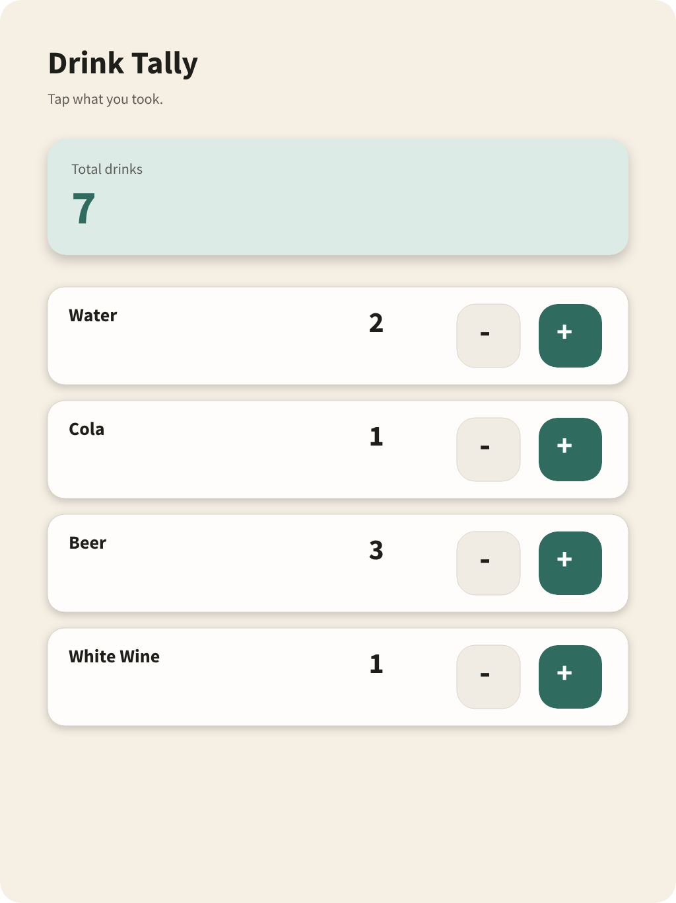

# Design Artifacts

This directory holds repo-tracked design snapshots for browser review and AI or human handoff.

Penpot is still the project's default design workspace, but the default repo handoff is a committed artifact here plus the matching brief in [`../docs/`](../docs/).

## Current Artifact

- Brief: [`../docs/penpot-example-drink-tally.md`](../docs/penpot-example-drink-tally.md)
- Portable SVG export: [`drink-tally-smoke-test.svg`](drink-tally-smoke-test.svg)
- Browser preview: [`drink-tally-smoke-test.png`](drink-tally-smoke-test.png)

## Notes

- Prefer SVG for the repo-tracked source snapshot because it is browser-viewable and readable by Codex.
- Keep a PNG preview next to the SVG when quick visual review matters.
- Keep Penpot-specific intent, state notes, and follow-ups in the markdown brief instead of trying to encode everything into the export.

